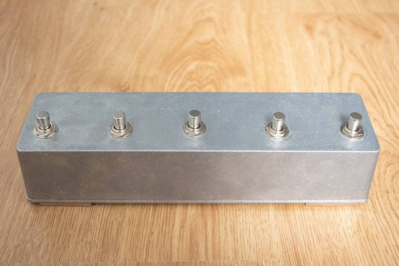
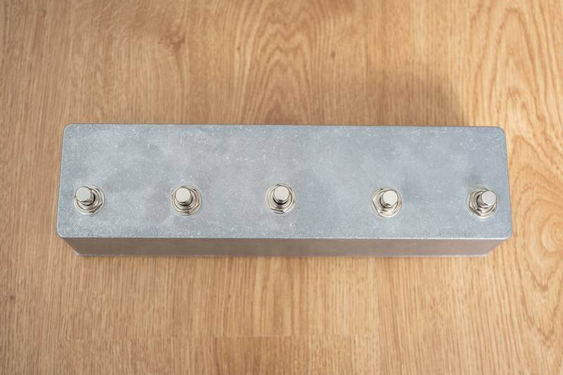
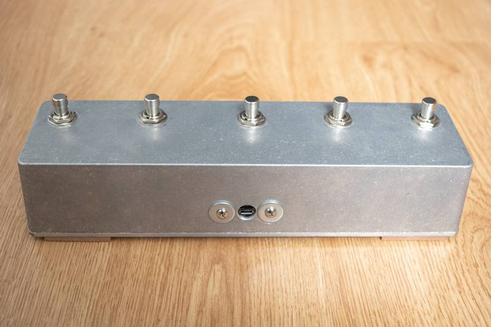
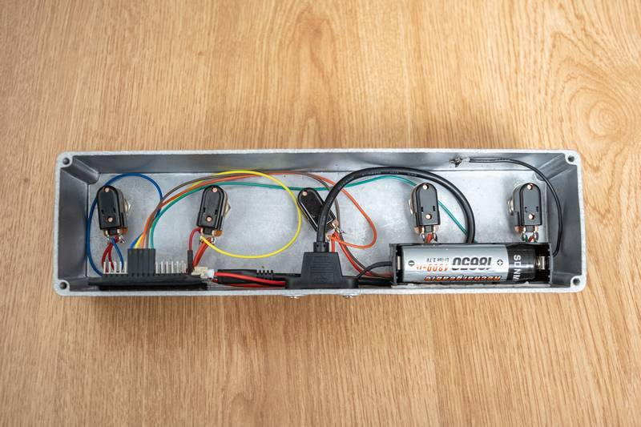
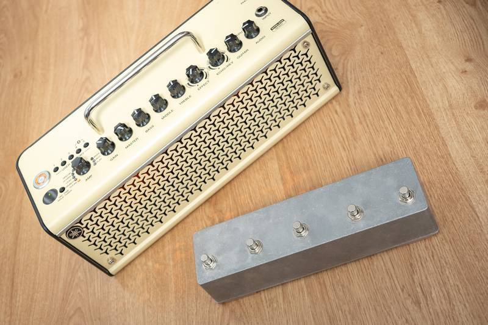
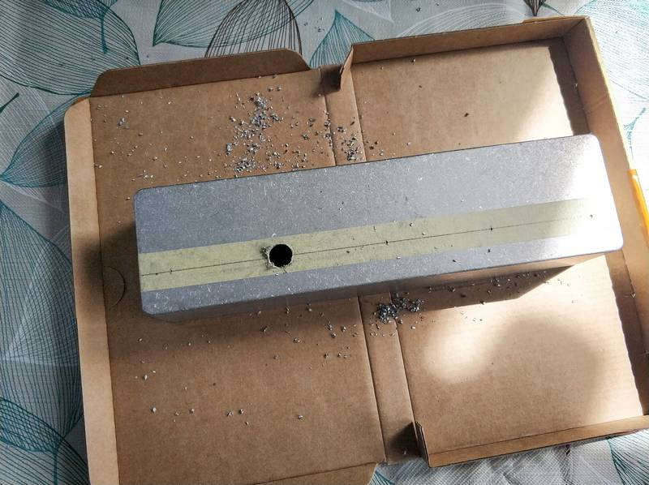
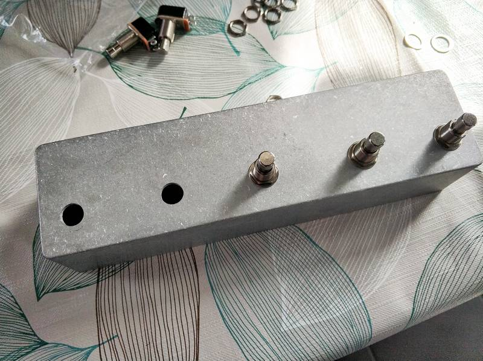
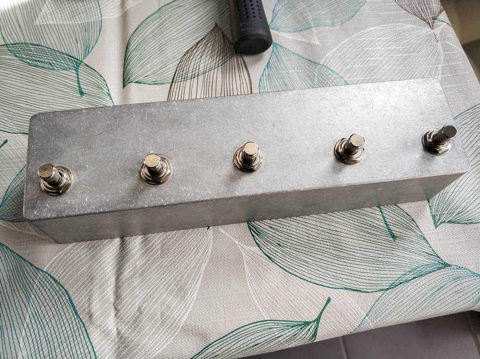
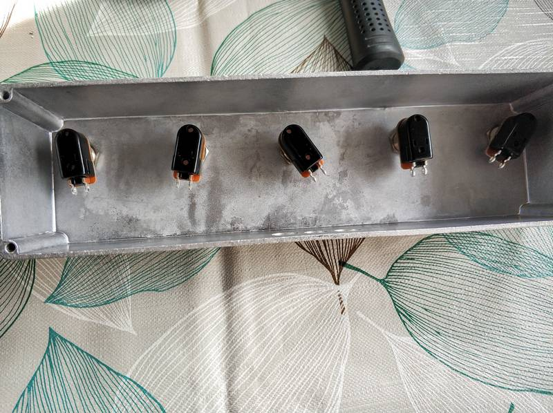
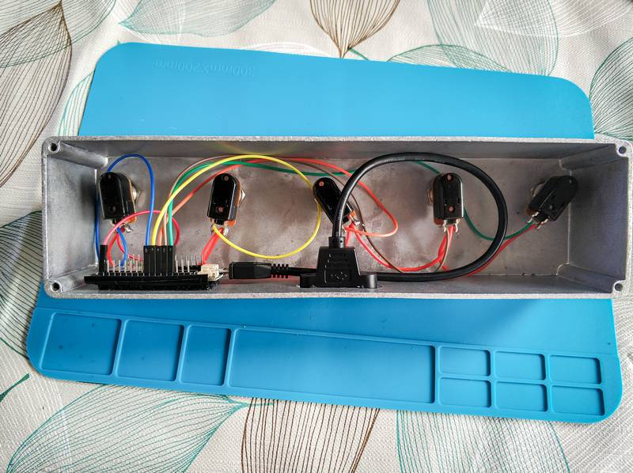

# spark-mini-ble-footswitch
DIY Bluetooth LE footswitch for Spark Mini guitar amp (not tested on the Spark 40)

## Acknowledgements

The Spark Mini's protocol is based on the project [SparkLolin](https://github.com/paulhamsh/SparkLOLIN) by [Paul Hamshere](https://github.com/paulhamsh). Many thanks for your help and input!

## Shopping List

All parts for this project have been purchased from AliExpress. This is what you need:

* Lolin D32 ESP32 board: https://www.aliexpress.com/item/32808551116.html
* 1032L aluminium pedal enclosure: https://www.aliexpress.com/item/4000094165020.html
* SPST 2-pin momentary footswitch (x5): https://www.aliexpress.com/item/32918205335.html
* AWG-22 silicone wires (multiple colours): https://www.aliexpress.com/item/4000627624331.html
* Female jumper cables for breadboard: https://www.aliexpress.com/item/4000145227927.html
* Micro-USB extension cable: https://www.aliexpress.com/item/4000144668278.html
* 18650 lithium-ion 3,7V battery: https://www.aliexpress.com/item/1005001969453906.html
* 18650 1X battery holder: https://www.aliexpress.com/item/33037738446.html

## ESP32 main board (Lolin D32)

You can use any ESP32 based board from any manufacturer, but in that case, have in mind that you'll need to look at the pinout of your board and change the code accordingly. 

**Lolin D32 ESP32-WROOM-32 specifications:** https://www.wemos.cc/en/latest/d32/d32.html

This board has some advantages over other models for use with batteries:

* It has a build-in voltage regulator for external power sources
* It has a build-in LiPo battery charger
* The battery is also connected to GPIO 35 which allows to read the battery level without external hardware

## Gallery

### First prototype

### Making of

